<p align="center">
  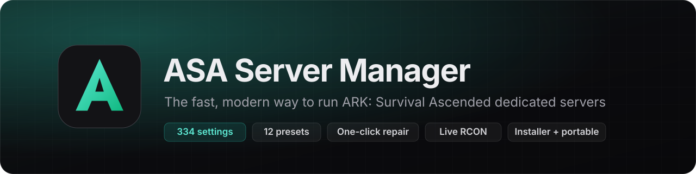
</p>

<p align="center">
  <a href="https://github.com/clawdroppin/ARK-SurvivalAscended-ServerManager/releases/latest/download/ASA-Server-Manager-Setup.exe"></a>
  <a href="https://github.com/clawdroppin/ARK-SurvivalAscended-ServerManager/releases/latest/download/ASA-Server-Manager-Portable.zip"></a>
</p>

<p align="center">
  <a href="https://github.com/clawdroppin/ARK-SurvivalAscended-ServerManager/releases"></a>
  <a href="https://github.com/clawdroppin/ARK-SurvivalAscended-ServerManager/actions"></a>
  
  
  
  <a href="LICENSE"></a>
</p>

<p align="center">
  A sleek, low-overhead desktop app for hosting <b>ARK: Survival Ascended</b> dedicated servers.<br>
  Install, configure every setting, manage mods and players, back up, schedule and repair – all from one window.
</p>

<p align="center">
  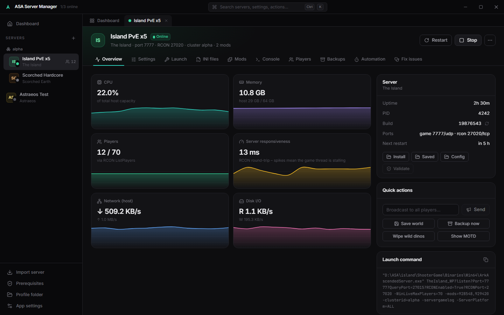
</p>

---

## ✨ Highlights

| | |
|---|---|
| 🚀 **Zero setup** | First-run wizard installs everything a server needs – Visual C++ runtime, the Amazon TLS certificates Epic's server list requires, DirectX and SteamCMD – with a **single** admin prompt. |
| 🎛️ **Every setting** | **334** `GameUserSettings.ini` / `Game.ini` options with sliders, exact values, official-default markers and one-click reset – plus stat grids, a level-curve generator, spawn/loot/engram editors and a raw INI editor with live validation. |
| 🎨 **12 presets** | Official, 2× event, small tribes, casual & community PvE, 10× / 100× boosted, breeder's paradise, competitive PvP, hardcore, solo & duo, builder's sandbox, roleplay – or save your own. |
| 🗺️ **Future-proof maps** | The map list updates itself from the community wiki, so maps released after your version show up automatically. Mod maps work too. |
| 📈 **Live dashboard** | CPU, RAM, network, disk, players and server responsiveness, live RCON console, chat feed and server log. |
| 🧩 **Mods** | Browse & search CurseForge, drag to reorder load order, update detection, passive mods. |
| 🛟 **Fix Server Issues** | One click checks and repairs prerequisites, configs, ports & firewall, stale locks, **corrupted saves** (with safe rollback), crashing mods and server files. |
| 🗂️ **Backups & automation** | Backups stored next to each server, automatic backups with retention, scheduled restarts with in-game countdowns, crash auto-restart and update checks. |
| 💼 **Installer or portable** | Use the installer, or the portable build that keeps *everything* in a folder next to the app – take it anywhere. |

## 📸 Screenshots

<table>
  <tr>
    <td>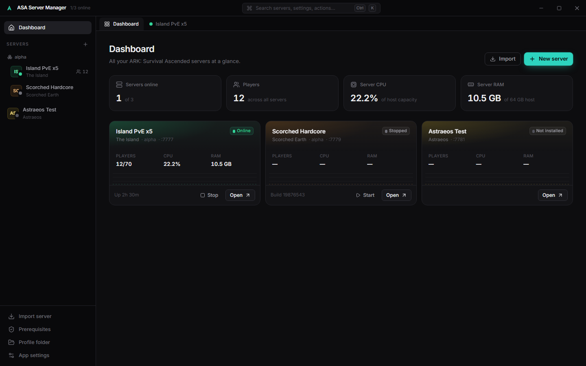<p align="center"><sub>Dashboard</sub></p></td>
    <td>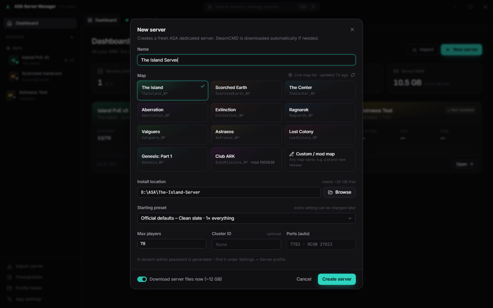<p align="center"><sub>Create a server with a live map list and starting preset</sub></p></td>
  </tr>
  <tr>
    <td>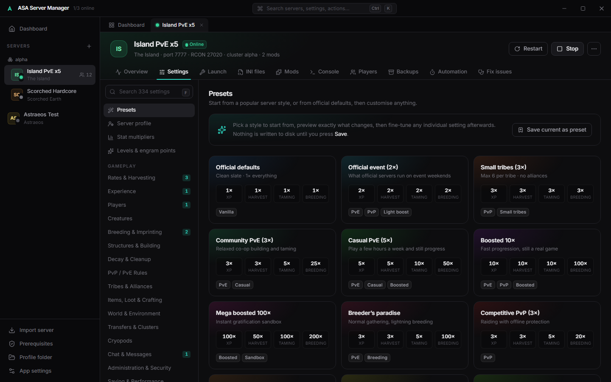<p align="center"><sub>Presets – preview every change before applying</sub></p></td>
    <td>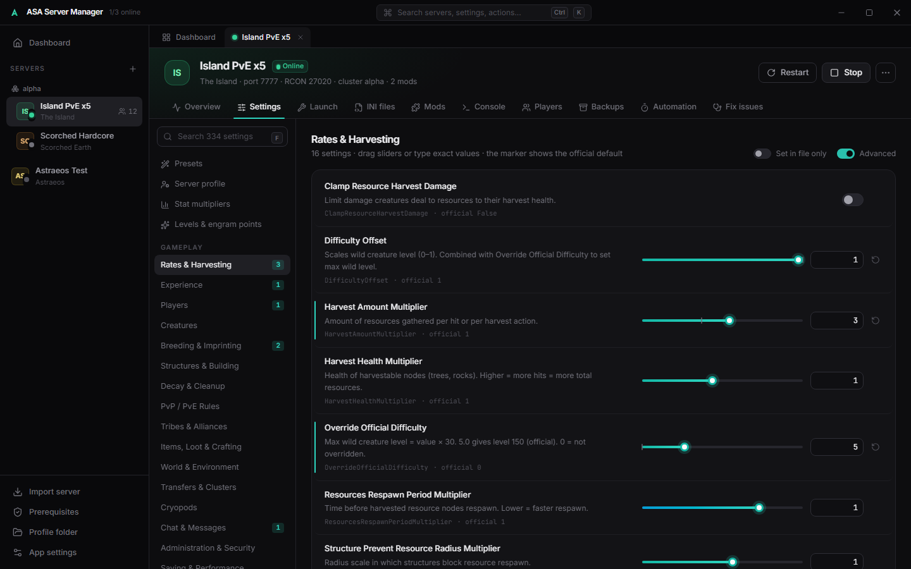<p align="center"><sub>334 settings with sliders and exact values</sub></p></td>
  </tr>
  <tr>
    <td>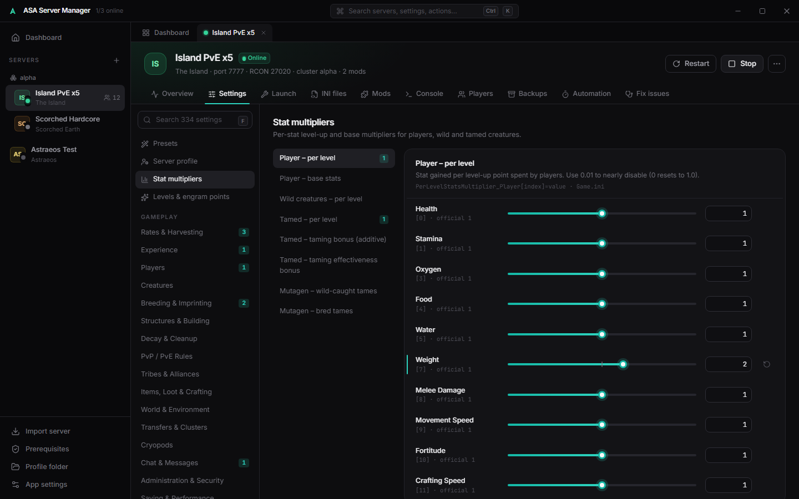<p align="center"><sub>Per-stat multipliers for players and creatures</sub></p></td>
    <td>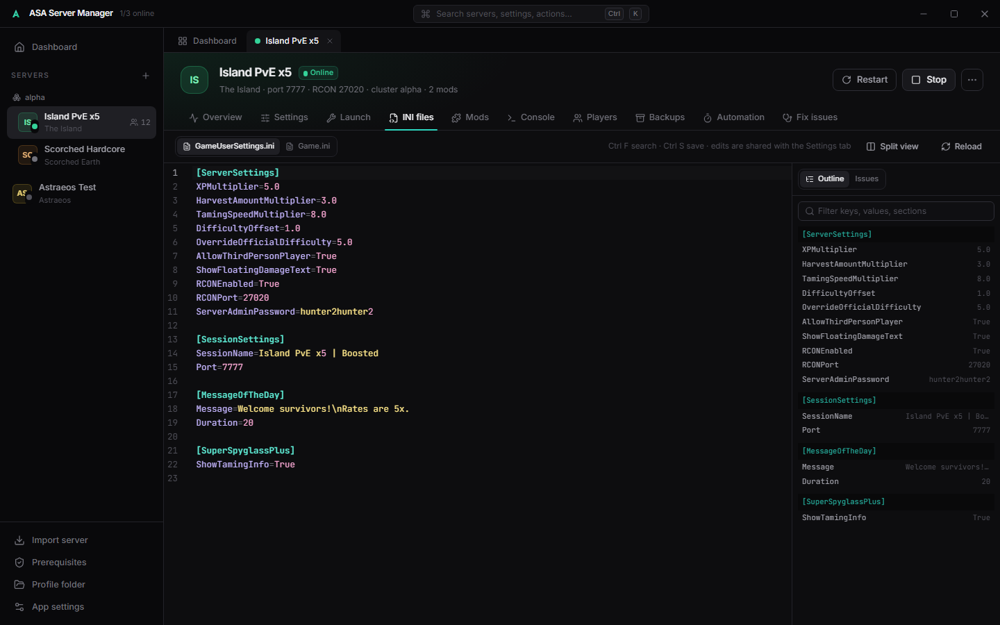<p align="center"><sub>Raw INI editor with live validation</sub></p></td>
  </tr>
  <tr>
    <td>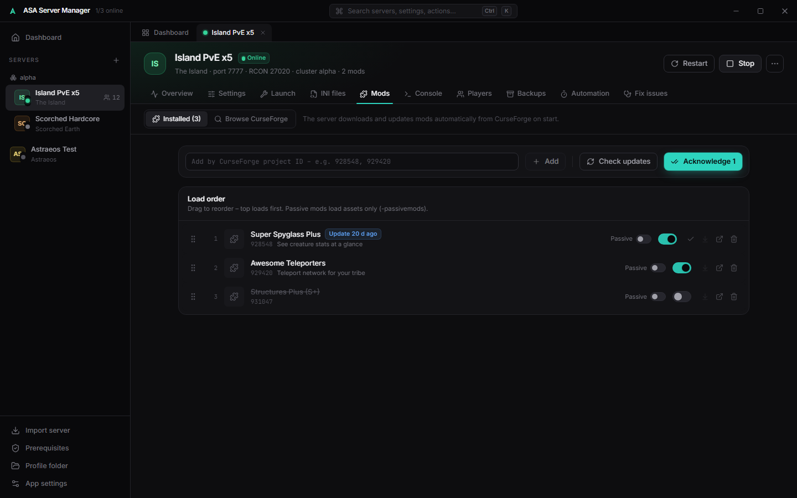<p align="center"><sub>Mod manager with drag-and-drop load order</sub></p></td>
    <td>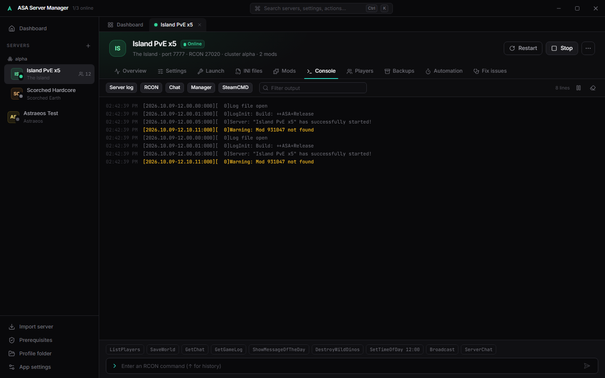<p align="center"><sub>RCON console, chat and server log</sub></p></td>
  </tr>
  <tr>
    <td>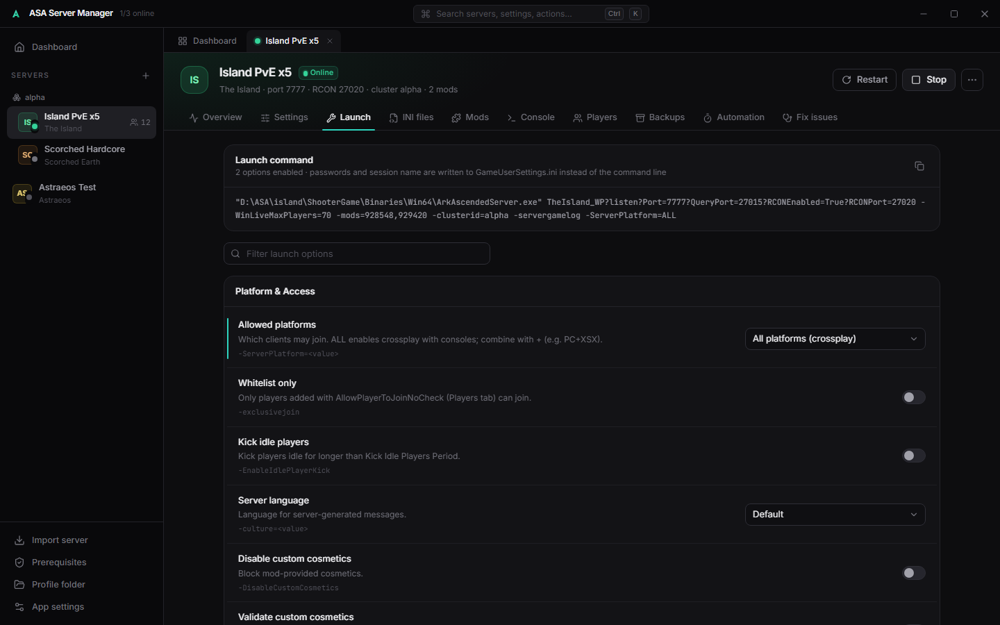<p align="center"><sub>81 launch options with live command preview</sub></p></td>
    <td>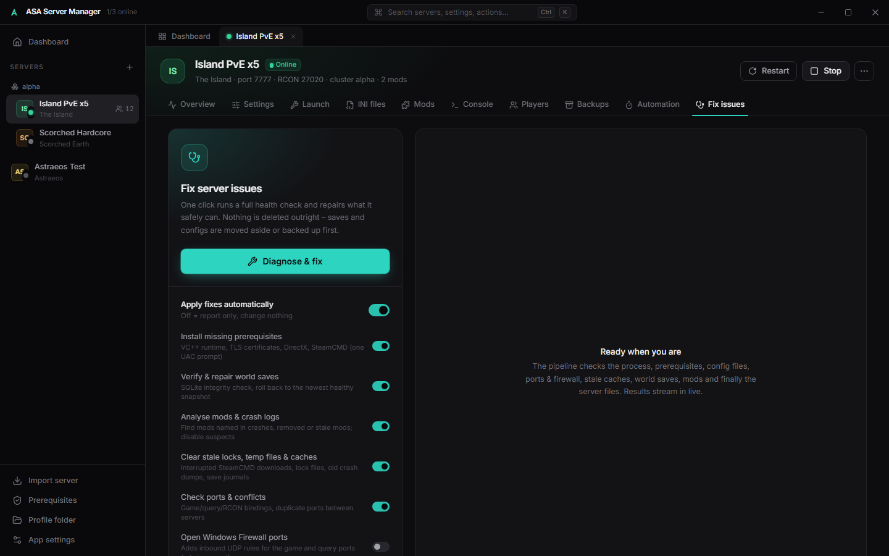<p align="center"><sub>One-click Fix Server Issues</sub></p></td>
  </tr>
</table>

---

## 📥 Download & install

1. Go to the **[latest release](https://github.com/clawdroppin/ARK-SurvivalAscended-ServerManager/releases/latest)** and pick one:
   - **`ASA-Server-Manager-Setup.exe`** – normal installer (recommended). Data lives in `%APPDATA%\com.asaservermanager.app`.
   - **`ASA-Server-Manager.msi`** – the same, as an MSI for managed deployments.
   - **`ASA-Server-Manager-Portable.zip`** – no install. Unzip anywhere you can write to (not *Program Files*); all data stays in the `data` folder beside the app.
2. Run it. Windows SmartScreen may warn because the app isn't code-signed yet – choose **More info → Run anyway**.
3. The **first-run wizard** checks your PC and installs anything missing (one administrator prompt). You can choose where SteamCMD goes.

**Requirements:** Windows 10/11 (64-bit) or Windows Server 2019+, ~15 GB disk per server (more for backups), and roughly 10–16 GB RAM per running server.

## 🚀 Quick start

1. Click **New server**. Pick a name, a **map** and an **install folder**, optionally a **starting preset** (e.g. *Casual PvE 5×*).
2. Leave **Download server files now** on and press **Create server**. SteamCMD downloads the ARK: Survival Ascended Dedicated Server (Steam AppID **2430930**, ~12 GB). Progress shows bottom-right.
3. Fine-tune anything under **Settings** (search with <kbd>Ctrl</kbd>+<kbd>F</kbd>), then press **Save** (<kbd>Ctrl</kbd>+<kbd>S</kbd>).
4. Press **Start**. The status turns **Online** once the server answers RCON (first boot can take a few minutes).
5. **Let players in from the internet:** forward **UDP** on the game port (default `7777`) on your router. *Fix issues → Open Windows Firewall ports* adds the firewall rule for you.
6. Players find the server in-game under **Unofficial** by its session name (enable *Show player servers* if needed).

> 💡 Press <kbd>Ctrl</kbd>+<kbd>K</kbd> anywhere for the command palette – jump to any server, view, action or individual setting.

## 📖 User guide

<details>
<summary><b>Servers, clusters & importing</b></summary>

- **Multiple servers**: each server gets its own tab. Give servers the same **Cluster ID** (Settings → Server profile) to allow character/dino transfers between them.
- **Import an existing server**: *Import server → Existing install folder* adopts a server you already have (from another tool or a manual SteamCMD install) without moving files.
- **Move or share a server**: *Backups → Export .asapack* creates one file with the profile, mods, launch options, configs and optionally saves. Import it on another PC with *Import server → From .asapack*.
- **Clone / remove**: the **⋯** menu in a server's header clones it (fresh ports, same settings) or removes it. Removing never deletes backups.
</details>

<details>
<summary><b>Settings, presets & launch options</b></summary>

- **Presets** (top of Settings) show exactly what will change – *current → new* – and can apply on top of your settings or from a clean official baseline. **Save current as preset** to reuse your own setup.
- **Every gameplay category** has sliders with the official value marked; the ↺ button removes a key so the official default applies again.
- **Advanced** sections: per-stat multipliers, level curve & engram points, creature overrides (spawn weights, replacements, per-class damage), stack sizes, engram overrides, spawn containers, loot crates and crafting costs.
- **Custom & mod keys** shows anything else in your files – mod configuration sections included – and lets you add new keys.
- **INI files** is a raw editor (split view, search, error highlighting) that shares unsaved edits with the graphical editor.
- **Launch** holds command-line options (crossplay platforms, BattlEye, logging, events, performance…) with a live preview of the exact launch command.
- ASA rewrites `GameUserSettings.ini` when it shuts down. If you save while a server is running, the manager re-applies your changes automatically after it stops.
</details>

<details>
<summary><b>Mods</b></summary>

- Add mods by **CurseForge project ID** – no account needed. The server downloads and updates them itself on start.
- To **browse and search**, add a free CurseForge API key (from [console.curseforge.com](https://console.curseforge.com/)) in **App settings**.
- Drag mods to set **load order**; mark content-only mods as **passive**. **Check updates** flags mods with newer versions.
</details>

<details>
<summary><b>Players, console & telemetry</b></summary>

- **Players** lists who is online (via RCON) with kick, ban, whitelist, private message and broadcast; ban/whitelist offline players by EOS ID; create custom quick-action command templates.
- **Console** combines the server log, RCON responses, chat and SteamCMD output with filters, plus an RCON prompt with history and quick commands.
- **Server responsiveness** is the RCON round-trip time – spikes mean the server thread is stalling (ASA doesn't expose a tick rate).
</details>

<details>
<summary><b>Backups, saves & automation</b></summary>

- Backups are zipped into **`<server folder>\Backups`** (or a global folder you choose in App settings). Restores move the current world to `_quarantine` first – nothing is ever lost.
- **World save integrity**: ASA saves are SQLite databases; the check runs SQLite's own integrity test and can roll back to any healthy rolling snapshot.
- **Automation** – crash auto-restart (with crash-loop protection), automatic backups & retention, daily scheduled restarts with chat countdowns (optionally updating first), auto-start with the app and periodic update checks.
</details>

<details>
<summary><b>Fix Server Issues</b></summary>

One click runs a full pipeline and repairs what it safely can (or just reports, if you turn fixes off):
duplicate processes · missing prerequisites · broken INI lines (a `.bak` is kept) · RCON setup · port conflicts and firewall rules · interrupted SteamCMD downloads and stale locks · unfinished save journals · **corrupt saves → rollback to the newest healthy snapshot** · mods named in crash logs, removed or outdated mods · SteamCMD file validation.
</details>

<details>
<summary><b>Where is my data? (profile folder)</b></summary>

Click **Profile folder** in the sidebar. It contains `settings.json` (app settings), `instances.json` (your servers), `presets.json` (your presets) and caches. Every write keeps a `.bak`, and an unreadable file is preserved as `.corrupt-<time>` and restored from backup.

| Edition | Profile folder |
|---|---|
| Installer | `%APPDATA%\com.asaservermanager.app` |
| Portable | `<app folder>\data` (move the folder freely – paths are fixed up automatically) |

Server files, saves and backups live in each server's own install folder.
</details>

## 🛠️ Troubleshooting

| Problem | Fix |
|---|---|
| Server doesn't appear in the in-game browser | Run **Fix issues** with *Install missing prerequisites* on (Amazon certificates), forward UDP `7777`, and search under *Unofficial* with *Show player servers* enabled. |
| "Steam refused the download" | Check your connection and that Steam isn't in maintenance; the app uses the free dedicated-server tool (AppID 2430930), so no Steam account is needed. |
| Server crashes on start | **Fix issues** analyses crash logs, disables suspicious mods and can validate files. Check *Console → Server log* for details. |
| Players can't join after enabling crossplay | Set *Launch → Allowed platforms* and make sure BattlEye settings match what your players use. |
| "Not enough disk space" during install | Free up space or pick another install folder – SteamCMD needs ~12 GB plus room for updates. |

## 🧑‍💻 Build from source

```bash
git clone https://github.com/clawdroppin/ARK-SurvivalAscended-ServerManager.git
cd ARK-SurvivalAscended-ServerManager
npm install
npm run tauri dev        # run the app with hot reload
npm run build:all        # installer (NSIS + MSI) and portable zip
```

Requires Node 20+, the Rust stable toolchain and WebView2 (built into Windows 10/11). `npm run dev` alone opens the UI in a normal browser with a mock backend – handy for UI work.
Releases are built by GitHub Actions: push a tag like `v0.2.0` and the [release workflow](.github/workflows/release.yml) publishes the installer, MSI and portable zip.

**Contributors and AI assistants:** read **[AGENTS.md](AGENTS.md)** first – it covers the architecture, conventions, gotchas and how to verify changes.

## 🙏 Credits

- **Created by [clawdroppin](https://github.com/clawdroppin)**, built together with **Claude** (Anthropic) using Claude Code.
- Built on **[Tauri](https://tauri.app)**, **[Rust](https://www.rust-lang.org)** / **[tokio](https://tokio.rs)**, **[React](https://react.dev)**, **[Tailwind CSS](https://tailwindcss.com)**, **[Motion](https://motion.dev)**, **[Zustand](https://zustand.docs.pmnd.rs)**, **[CodeMirror](https://codemirror.net)**, **[cmdk](https://cmdk.paco.me)**, **[Lucide](https://lucide.dev)** icons, **[Inter](https://rsms.me/inter/)** and **[JetBrains Mono](https://www.jetbrains.com/lp/mono/)** fonts, **[sysinfo](https://crates.io/crates/sysinfo)**, **[rusqlite](https://crates.io/crates/rusqlite)**, **[reqwest](https://crates.io/crates/reqwest)** and **[zip](https://crates.io/crates/zip)**.
- Setting names, types and defaults – and the live map list – come from the community **[ARK Wiki server configuration reference](https://ark.wiki.gg/wiki/Server_configuration)** (CC BY-NC-SA). Descriptions, ranges and presets are this project's own.
- Server files are installed with Valve's **[SteamCMD](https://developer.valvesoftware.com/wiki/SteamCMD)**; mod data comes from the **[CurseForge API](https://docs.curseforge.com/)**.
- Preset rate tiers are informed by community hosting guides such as those from [low.ms](https://low.ms/blog/best-ark-server-settings-pvp-pve), [XGamingServer](https://xgamingserver.com/blog/ark-survival-ascended-server-settings-guide) and [Nitrado](https://server.nitrado.net/en-GB/news/best-ark-survival-ascended-settings).

## ⚖️ License & disclaimer

Released under the [MIT License](LICENSE).

*ARK: Survival Ascended* is a trademark of Studio Wildcard / Snail Games. This is an independent, community-made tool and is not affiliated with or endorsed by Studio Wildcard, Snail Games, Valve, Epic Games or CurseForge.
